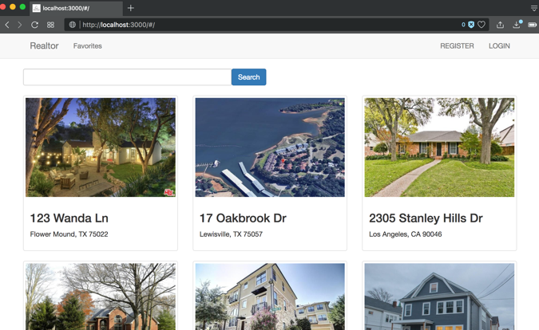

# 2017 Fall Web Programming Languages CS6314
Instructor: **Dr. Nurcan Yuruk**

This course focuses on the understanding of web architecture, standards, protocols, tools, and technologies.

## What's inside the folder
This folder contains the source code for the project of the course.

- `Realtor` folder contains the source code for the project.

- `FinalProject.docx` is the requirement for the project.

- `House.txt` contains some sample data for the "House" collection in MongoDB database.

- `Report.pdf` is a very concise report for the project.

- `realtor.png` is the snapshots of the user interface.

## Project: Realtor Website
MEAN stack / Node.js / MongoDB / Web Application

The project is to implement a simple realtor website. Users can sign up and login, search and browse, add house to the favorite list, etc. Administrator can add, delete and update the house information.

## How to run the code
1. in terminal, run `mongod` to start MongoDB database
2. download the "Realtor" folder
3. open a new window in terminal, cd to the "Realtor" folder,
4. run `npm install`  
5. run `npm start`
6. in browser, go to `http://localhost:3000/`
7. the id and password for administrator is both "admin"

Due to the time limit and the load of other coursework, this application was just a rough sketch. (For example, there is yet no image upload functionality when adding a house. We need to manually update it. -- Go to `Realtor/public/image/` folder, create a directory, name it as the id of the house in the database, and put images into the directory. The name of the images should be `0.jpg`, `1.jpg`, `2.jpg` and so on.)
